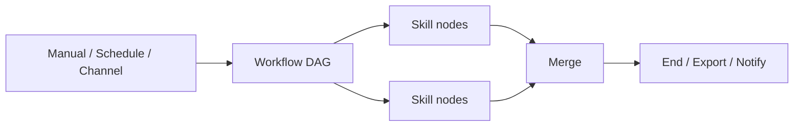

# MChat — Multi-Tenant Vertical RAG Platform

[](LICENSE)
[](https://www.python.org/)
[](https://nodejs.org/)

**[中文文档](README.zh.md)** · **[GitHub](https://github.com/windinwing/mchat)**

MChat is a **lightweight, embeddable, multi-tenant vertical RAG platform**. It combines a streaming Bot engine, production-grade RAG knowledge base, hot-reload Skill plugins, **visual Workflow orchestration (Beta)**, and a one-line embeddable Widget — with **10+ LLM providers** and multi-channel delivery (Web Widget, WebSocket, REST, WeChat Official Account, and more).

Built-in **AI customer service** works out of the box. Extend the same stack into **vertical channels** — patent search, medical, legal, and other domain RAG packages with dedicated knowledge bases, skill packs, and tuned retrieval — embed anywhere with a single `<script>` tag.

## Why MChat?

| Strength | What you get |
|----------|----------------|
| **Vertical RAG in one stack** | Bot + hybrid retrieval (vector + BM25 + RRF) + rerank + query rewrite + parent-child chunks — not a thin chatbot wrapper |
| **Skills that ship** | Hot-reload `SKILL.md`, OpenClaw-compatible packs, URL/zip install, ClawHub (`patent-search`, etc.) |
| **Workflow orchestration (Beta)** | ComfyUI-style graph editor (pointer/pan), DAG runs, merge nodes, approval gates, channel & schedule triggers |
| **Embed & multi-tenant** | Branded Widget per channel; isolated agents, skills, and knowledge bases |
| **Operator-friendly** | Full admin UI in **English & 简体中文**, dashboards, channel rules, skill schedules |
| **Developer-friendly** | FastAPI + React, Swagger, Docker Compose, MIT license |

## Live websites

- [English main site](http://mchat.chat)
- [Chinese main site](https://mchat.9235.net)
- [Full screenshot tour](docs/product-tour.en.md)
- [Product roadmap](docs/roadmap.en.md)
- [Workflow orchestrator (Beta)](docs/workflow-orchestrator.en.md)

## UI preview

Click any screenshot to open the full image.

### Homepage and admin zones

[](docs/images/mchat.home.zone.en.png)

### Conversation management

[](docs/images/mchat.conversations.en.png)

### Vertical channel configuration (Agent)

[](docs/images/mchat.customer.en.png)

### Knowledge base

[](docs/images/mchat.knowledge.en.png)

### Widget demo

[](docs/images/mchat.widget.en.png)

### Widget chat panel

[](docs/images/mchat.chat.en.png)

### Channel management

[](docs/images/mchat.channel.en.png)

### Workflow orchestration (Beta)

[](docs/images/workflow.en.png)

[](docs/images/workflow.graph.en.png)

## Features

- **Bot engine** — Streaming LLM inference + tool calling; OpenAI, Anthropic, Google, DeepSeek, Ollama, Groq, and more
- **Skill plugins** — Hot-reload `SKILL.md` from disk/zip/URL, OpenClaw-compatible formats; premium packs as vertical add-ons
- **RAG knowledge base** — Multi-strategy chunking, multi-provider embeddings, hybrid retrieval (vector + BM25 + RRF), rerank, query rewriting, parent-child context
- **Workflow orchestration (Beta)** — React Flow DAG editor, linear or graph execution, merge/condition/approval nodes, built-in report templates, manual/schedule/channel triggers
- **Embeddable Widget** — One `<script>` tag for branded vertical RAG chat on any website
- **Multi-tenant** — Independent channel configs with isolated AI, skills, and knowledge bases
- **Vertical channels** — One-click domain templates: model, prompt, KB, rerank, skills, widget theme
- **Multi-channel** — Web Widget, REST, WebSocket, WeChat (DingTalk/WhatsApp/Telegram [planned](docs/roadmap.en.md#3-channels))
- **Speech input** — OpenAI Whisper (optional local models)
- **Security** — JWT, API keys, RBAC
- **Docker** — `make docker-up-lite` full stack

## Workflow orchestration (Beta)

MChat **Workflow** chains multiple Skills into reusable pipelines — not just one-shot chat, but multi-step automation with parallel branches, conditional routing, human approval, and structured outputs (reports, exports, alerts).



| Concept | Role |
|---------|------|
| **Skill** | Smallest unit — a tool, function, or webhook (`patent-search`, custom packs, etc.) |
| **Workflow** | Ordered steps or a **graph** (`graph_json`) that wires Skills together |
| **Trigger** | **Manual** (admin run-once), **Schedule** (cron via Skill Schedules + worker), or **Channel** (message rules on WeChat / Telegram / Web) |

**Visual graph editor** (Admin → **Workflows**, `/admin/workflows`):

- ComfyUI-style canvas: pointer vs pan (`V` / `H`), drag nodes from the skill library
- Node types: `start` · `skill` · `condition` · `approval` · `merge` · `end`
- **Payload mapper** — `${input.keyword}`, `${nodes.<id>.result.xxx}` templates per node
- **Merge** — wait for parallel branches, then feed downstream chart/export steps
- **Approval** — pause a run until an operator approves or rejects in the admin UI

**Templates**: built-in flows such as **Patent Multi-Dimension Report** (search → parallel analysis → merge → chart/Excel/Word/PPT). Save any workflow as **My template** and instantiate it again with one click. Skills bind by `skill_name`, so the same graph works across tenants after skills are installed.

**Example**: one `patent-search` skill can appear in many nodes with different payloads — `command: search` for retrieval, `command: analysis` + `dimension: applicant|ipc|…` for parallel analytics, then `patent-report` for export.

**Getting started**

1. `make setup && make dev` (or `make docker-up-lite`)
2. Install skills (e.g. `patent-search`, `patent-report`) under **Admin → Skills**
3. Open **Admin → Workflows** — use a template or build a graph, then **Run once**
4. For **scheduled** runs: start the worker — `make dev-worker` or set `WORKER_ENABLED=true` in `.env`

> **Beta** — core paths are production-ready for validation; graph DSL and UI may evolve.  
> Details: [Workflow orchestrator](docs/workflow-orchestrator.en.md) · [Product tour — Workflow](docs/product-tour.en.md#workflow-orchestration-beta) · API: [docs/api.en.md#workflows-beta](docs/api.en.md#workflows-beta)

## Quick start

### Docker (recommended)

```bash
git clone https://github.com/windinwing/mchat.git
cd mchat

make docker-up-lite
# If Docker requires sudo on your machine, the script will use it automatically.

# Admin UI:  http://localhost:5173/admin
# API docs:  http://localhost:3001/docs
# Landing:   http://localhost:5173/
```

Equivalent manual command (creates `ops/docker/.env` first):

```bash
cp ops/docker/.env.example ops/docker/.env
docker compose -f ops/docker/docker-compose.lite.yml --env-file ops/docker/.env up -d --build
```

**Default admin credentials** (created on first startup): `admin` / `admin123`  
Change the password under **Admin → Users** after sign-in. Override via `ADMIN_USERNAME` / `ADMIN_PASSWORD` in `.env`. Set `SHOW_BOOTSTRAP_CREDENTIALS=false` to hide the hint on the login page in production.

### Embed the Widget

```html
<script
  src="http://localhost:5173/widget-loader.js"
  data-mchat-url="http://localhost:3001"
  data-agent-id="YOUR_AGENT_ID"
  data-primary-color="#3b82f6"
  data-welcome-message="Hello! How can I help you?"
  data-bot-name="Assistant"
></script>
```

### Local development

**Prerequisites** (new machine):

| Tool | Version | Ubuntu/Debian |
|------|---------|---------------|
| Python | 3.10+ (3.12 recommended) | `sudo apt install python3 python3-venv python3-pip` |
| Node.js | **20+** (required for `make dev`) | [nodejs.org](https://nodejs.org/) or `nvm install 20` |
| Docker | recent | for lite MySQL via `make setup` / `make docker-up-lite` |
| make | — | `sudo apt install make` |

> `make` uses bash + `source venv`. Do **not** run `make setup`, `make install`, or `make dev` with sudo.  
> For short CLI: `make install`, then `source scripts/env.sh`, or `./bin/mchat`.

**After git pull (pick one path)**:

```bash
# Path A — local hot reload (needs Node 20+)
git pull
make setup && make dev

# Path B — Docker full stack
git pull
make docker-up-lite
```

**First clone**:

```bash
git clone https://github.com/windinwing/mchat.git
cd mchat
make setup && make dev          # or: make docker-up-lite
```

**Docker / MySQL commands**:

| Command | Description |
|---------|-------------|
| `make docker-up-lite` | Create `.env`, fix MySQL password, build & start |
| `make docker-down-lite` | Stop stack (keep volumes) |
| `make docker-logs-lite` | Tail logs |
| `make db-mysql-dev` | MySQL only (for `make dev`, default host port **3307**) |
| `make db-docker-reset-lite` | Wipe MySQL volume (password mismatch) |
| `MCHAT_RESET_FORCE=1 make reset-fresh` | Full wipe for clean re-test |

**MySQL (single lite config)**:

- Credentials: `mchat` / `mchat123`, database `mchat`, host port **3307** (see `ops/docker/.env`).
- `make setup` syncs `DATABASE_URL` in `src/backend/.env` automatically.
- Existing MySQL: `MCHAT_SETUP_MYSQL=0 make setup` and set `DATABASE_URL` yourself.
- `Access denied for user 'mchat'`: `make db-docker-reset-lite && make setup`.
- `make dev` stops Docker frontend/backend if they occupy port 5173 (MySQL is kept).

**Step by step** (without full `make setup`):

```bash
make install
make db-mysql-dev
make dev
```

```bash
make test
make lint
source scripts/env.sh && mchat run
# or: ./bin/mchat run
```

# Backend:  http://localhost:3001  (/docs)
# Frontend: http://localhost:5173
# Admin UI: http://localhost:5173/admin  (default login: admin / admin123)

## Project structure

```raw
mchat/
├── src/
│   ├── backend/          # FastAPI (Python 3.12+)
│   │   └── app/
│   │       ├── api/      # REST routes
│   │       ├── bot/      # Bot engine + LLM providers
│   │       ├── knowledge/# RAG + Milvus
│   │       ├── skill/    # Skill system
│   │       ├── worker/   # Schedules & workflow jobs
│   │       └── channels/ # WeChat & channel adapters
│   └── frontend/         # React + Vite + Tailwind
│       └── src/
│           ├── i18n/     # zh / en (react-i18next)
│           └── pages/    # Landing + admin console
├── skills/               # Skill packages
├── channel_templates/    # Vertical channel templates (patent, medical, etc.)
├── docs/                 # Architecture, API, deployment, roadmap
├── ops/docker/           # Docker Compose
└── Makefile
```

## Supported LLM providers

| Provider | Default API base | Notes |
|----------|------------------|-------|
| `openai` | https://api.openai.com/v1 | GPT-4o, o1, etc. |
| `anthropic` | https://api.anthropic.com | Claude |
| `google` | https://generativelanguage.googleapis.com | Gemini |
| `deepseek` | https://api.deepseek.com | OpenAI-compatible |
| `ollama` | http://localhost:11434/v1 | Local models |
| `groq` | https://api.groq.com/openai/v1 | Fast inference |
| `zhipu` / `moonshot` / `siliconflow` / `together` | *(configure `api_base`)* | Regional / hosted APIs |
| `openai-compatible` | *(configure `api_base`)* | Any OpenAI-compatible endpoint |

## API overview

| Group | Path | Description |
|-------|------|-------------|
| Chat | `/api/chat/*` | Conversations and messages |
| Agents | `/api/agents/*` | AI configuration |
| Knowledge | `/api/knowledge/*` | Documents and retrieval |
| Widget | `/api/widget/*` | Embedded chat API |
| Skills | `/api/skills/*` | Skill management |
| Workflows | `/api/workflows/*` | Workflow CRUD, runs, templates (Beta) |
| Channels | `/api/channels/*` | WeChat and other channels |
| Channel Templates | `/api/channels/templates/*` | One-click vertical channel creation |
| Speech | `/api/speech/*` | Voice transcription |
| Auth | `/api/auth/*` | Login / JWT |
| WebSocket | `/ws` | Real-time streaming |
| Health | `/api/health` | Service status |

See [docs/api.md](docs/api.md) or `/docs` (Swagger) after startup.

## Internationalization

The admin console and landing page support **English** and **简体中文**. Language preference is stored in `localStorage` (`mchat_lang`). Switch language from the header or sidebar.

## CLI

After `make install`:

```bash
source scripts/env.sh
mchat run
mchat skill list
```

Or: `./bin/mchat run`. Prefer `make dev` for daily work.
## Skill compatibility

- Supports standard frontmatter `SKILL.md` skill packages
- Supports OpenClaw-style `SKILL.md` locale blocks (auto `config.i18n` for UI display names)
- Admin can install skills by zip upload or URL (`/api/skills/install-url`)
- CLI supports direct URL or ClawHub name install, for example: `mchat skill install patent-search`
- **Premium skill packs**: Vertical channels can bundle specialized skills as value-added services
- **Workflow reuse**: One skill (e.g. `patent-search`) can appear in multiple DAG nodes with different `command` / `dimension` payloads

## Docker variants

| File | Services | Use case |
|------|----------|----------|
| `docker-compose.lite.yml` | MySQL + Backend + Frontend | **Default** (`make setup` / `make docker-up-lite`) |
| `docker-compose.yml` | + Milvus, etcd, MinIO, Redis | Full RAG |
| `docker-compose.prod.yml` | + Nginx HTTPS | Production |

## Tech stack

**Backend:** FastAPI, SQLAlchemy 2.0, Milvus, OpenAI / Anthropic SDKs, JWT, Loguru  

**Frontend:** React 19, TypeScript, Vite, Tailwind CSS 4, Zustand, react-i18next, React Flow

## License

[MIT License](LICENSE)

## Contributing

Contributions are welcome. See [CONTRIBUTING.md](CONTRIBUTING.md) if present.
