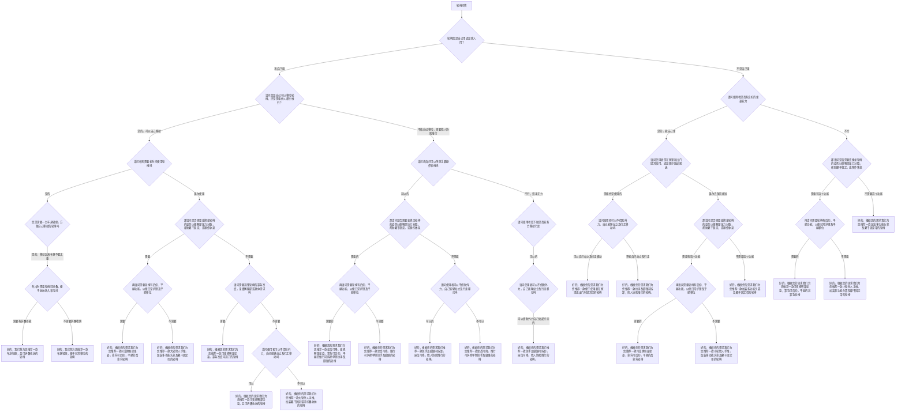

# 轮椅选购决策树参考

## 使用说明

- 从根节点开始，每次只问当前分支的下一个问题。
- **家人用** → 只问「坐姿能力」，禁止问「自推还是他人推」。
- 用户说「坐不好/坐姿差/坐不稳」= 坐姿能力不行（走 AC=不行 分支）。
- 走到叶子节点后，**同一条回复必须含 1–3 个表内型号**，不得因缺身高体重而只给方向或只追问体型。
- 后躺需求 → 同条回复必须列出 SY1-RR60-44 与 KM-5001 F20。
- 表内无字段的能力（头靠、固定带、可拆扶手等）写「待确认」，但不阻止输出型号。
- 推荐说明完成后，只追加一次固定小程序链接。

## 决策树流程图

## 固定小程序链接

[打开微信小程序查看商品详情与购买](https://wxaurl.cn/qNZlBoB2QQm)

## 叶子结论如何落到产品表

| 叶子结论 | 产品表筛选思路 | 输出注意事项 |
|------|------------------|------------|
| 车身轻便，且可折叠收纳 | 可折叠 + 净重更低；自推优先大轮/皆可，护理优先小轮 | **必须**输出 1–3 个表内型号 |
| 车身轻便，便于日常移动 | 常用 + 皆可/大轮 + 可折叠 | **必须**输出 1–3 个表内型号 |
| 可后仰、平躺的高靠背轮椅 | 筛「是否可以后躺 = 是」：河村 SY1-RR60-44、康扬 KM-5001 F20 | **必须**输出后躺型号 |
| 大轮他人手推，加装头靠及躯干固定带 | 按护理/大轮/常用/偶尔 + 体型筛表内型号 | **必须**输出 1–3 个；头靠/固定带写待确认 |
| 可变换臀部坐姿，靠背高度可调 | 按频率+折叠+轮型+体型筛 | **必须**输出 1–3 个；姿势/靠背可调写待确认 |
| 可变换臀部坐姿，且可折叠收纳 | 可折叠 + 体型匹配 | **必须**输出 1–3 个；姿势变换写待确认 |
| 大轮他人手推，加装躯干固定带，可折叠 | 可折叠 + 大轮/皆可 + 体型 | **必须**输出 1–3 个；固定带写待确认 |
| 坐高可降，推行可拆除单侧扶手及脚踏 | 护理/小轮或皆可 + 可折叠 + 体型 | **必须**输出 1–3 个；坐高/可拆写待确认 |
| 扶手及脚踏可拆卸，座位可降，他人协助推行 | 护理 + 小轮 + 可折叠 + 体型 | **必须**输出 1–3 个；拆卸/坐降写待确认 |
| 便于在家里或出门时经常坐的轮椅 | 常用 + 皆可 + 可折叠 + 座宽/承重匹配（注意斤→公斤） | **必须**输出 1–3 个表内型号 |
| 扶手及脚踏可拆卸，他人协助推行 | 护理 + 小轮 + 可折叠 | **必须**输出 1–3 个；拆卸写待确认 |
| 小轮他人手推，加装多功能头靠及躯干固定带 | 护理 + 小轮 + 频率匹配 | **必须**输出 1–3 个；头靠/固定带写待确认 |
| 加装多功能头靠及躯干固定带 | 按使用频率 + 护理/小轮优先 | **必须**输出 1–3 个；配件写待确认 |

## 产品表筛选优先级

1. **确认体重单位**（斤 → 公斤）后再筛承重。
2. 使用对象：自推 → 皆可/大轮；护理 → 护理/小轮。
3. 使用频率：长时间 → 常用；短途 → 偶尔。
4. 关键功能：后躺、折叠、轮型、净重、座宽、承重。
5. 筛完后输出 1–3 个最接近的表内型号；配件类需求单独「待确认」。

## 未覆盖回答的处理

- 双手无力且双下肢也不能移动等 → 只给方向 + 人工评估，不编造型号。
- 表内确实筛不出合适条目 → 说明原因，保留方向性建议 + 小程序链接。

## 产品覆盖表补充

详细字段见 `manual-wheelchair-product-table.md`，与 SKILL.md 内嵌表一致。
