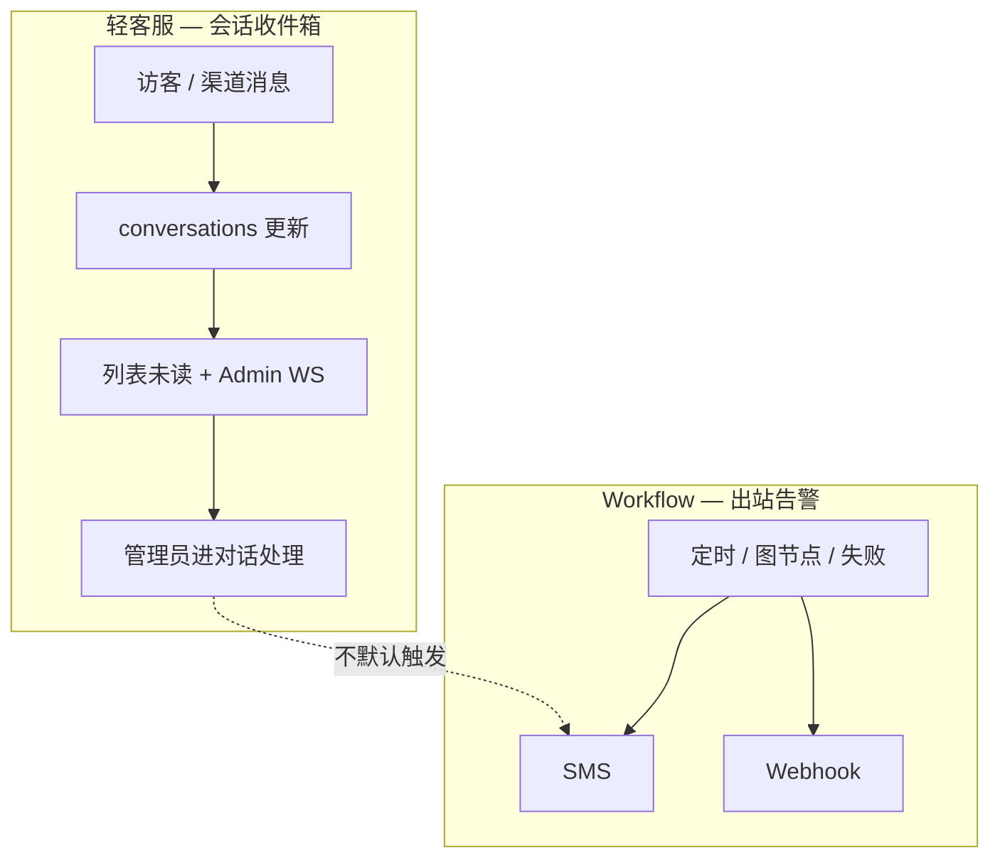
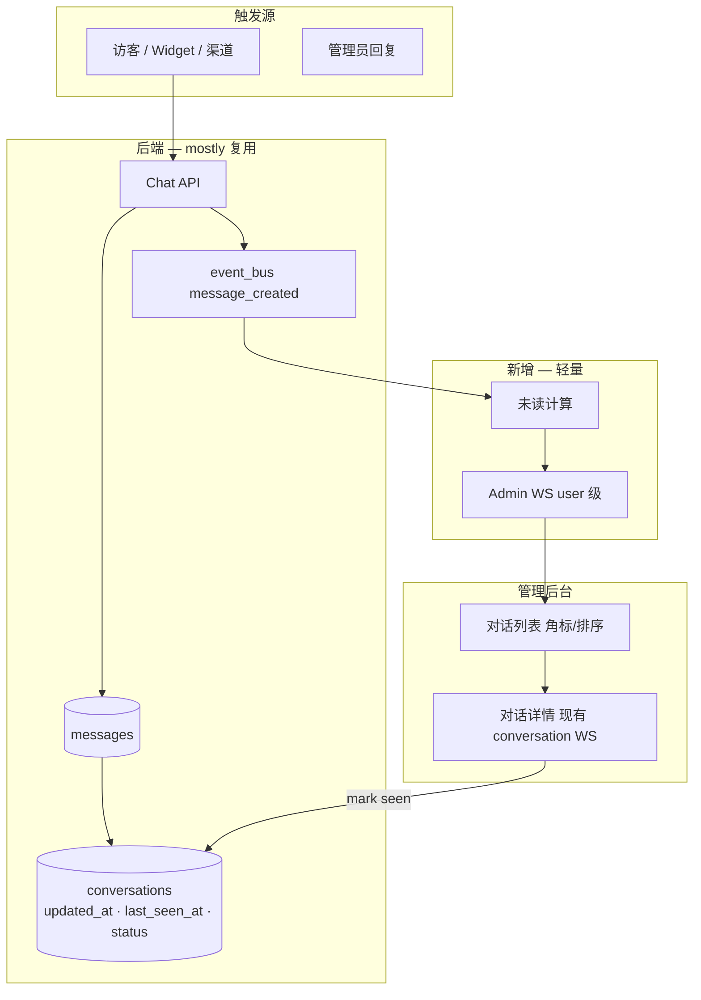
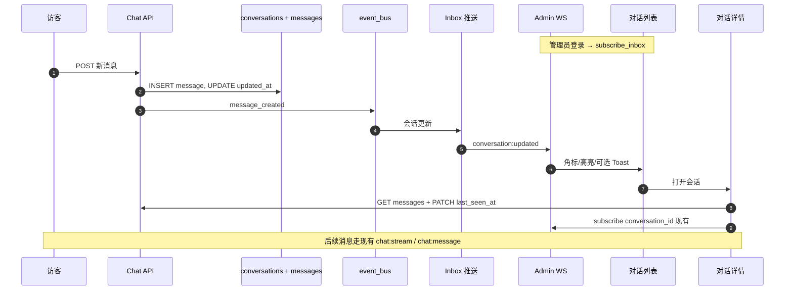
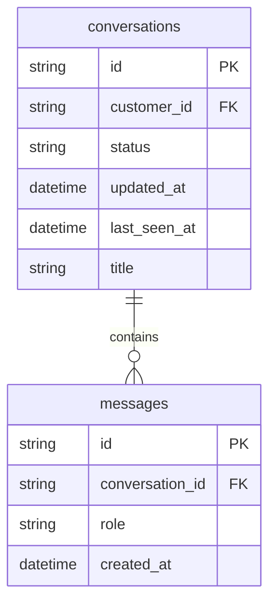
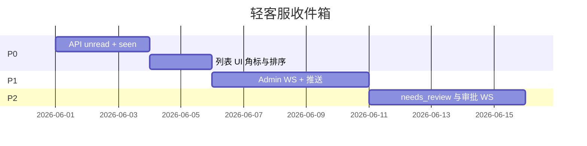

# 轻客服：会话收件箱与站内提醒（设计草案）

> **状态**：设计 / 未实现  
> **定位**：垂直 RAG + 轻客服 — AI 为主，管理员偶尔介入  
> **相关**：[短信通知（Workflow 出站）](notifications.zh.md) · [Workflow 编排器](workflow-orchestrator.zh.md)

---

## 1. 背景与结论

MChat 不是呼叫中心产品。主路径是 **RAG / Skill / Workflow** 自动应答；人工只在少数会话里补位。

因此 **不做** 独立「站内消息中心 / Notification Orchestrator / 坐席抢单队列」等重度方案。

**轻量定义**：站内提醒 = **会话即收件箱**

- 未读：`updated_at > last_seen_at`（或 API 返回 `unread: true`）
- 已读：管理员打开会话 → 更新 `last_seen_at`
- 实时：Admin 级 WebSocket 推送 `conversation:updated`（非全局铃铛）
- **短信**：仅 Workflow / 系统告警出站，见 [notifications.zh.md](notifications.zh.md)，**不参与**客服接入链路

`docs/workflow-orchestrator.zh.md` 中「尚未接入站内消息中心」指本方案尚未落地，而非要做独立消息中心。

---

## 2. 双通道边界

| 通道 | 用途 | 接收方 | 实现状态 |
|------|------|--------|----------|
| **会话收件箱（Inbox）** | 访客新消息、待人工查看 | 登录管理后台的 admin / agent | 📋 本文档（未实现） |
| **SMS（mchat-notify）** | Workflow 节点、运行失败告警 | 手机号白名单 | ✅ 已有（dev + 可选 provider 插件） |
| **Webhook** | Workflow 失败 / 审批拒绝 | 外部系统 URL | ✅ 已有 |



---

## 3. 架构总览



**刻意不做（除非产品信号变化，见 §8）：**

- `user_notifications` 表、全局铃铛、30 天通知归档
- 坐席池、轮询分配、抢单
- Workflow 内 `notify_in_app` 节点（与 SMS 节点并列的重度能力）

---

## 4. 端到端时序



离线管理员无 WS 时，下次 `GET /conversations` 仍可见未读（依赖 DB，不丢）。

---

## 5. 数据模型（不建新表 — P0 方案）

现有 `conversations` 已含 `last_seen_at`、`updated_at`、`status`（`active` / `closed`）。

| 规则 | 说明 |
|------|------|
| 有未读 | `status = active` 且 `updated_at > last_seen_at` |
| 标已读 | 打开会话 → `last_seen_at = now()` |
| 列表排序 | 建议 `updated_at DESC` |
| 可选 | 第三态或标签 `needs_review`（待人工），见 §8 未决项 |



---

## 6. Admin WebSocket 协议（草案）

与现有 **按 `conversation_id` 订阅** 的 WS 并列；连接仍为 `/ws` + JWT。

**Client → Server**

```json
{ "type": "subscribe_inbox" }
{ "type": "unsubscribe_inbox" }
```

**Server → Client**

```json
{
  "type": "conversation:updated",
  "conversation_id": "...",
  "customer_id": "...",
  "preview": "用户：请问…",
  "unread": true,
  "updated_at": "2026-05-30T12:00:00Z"
}
```

```json
{
  "type": "inbox:stats",
  "unread_total": 3
}
```

`ConnectionManager` 需扩展：`user_id → Set[WebSocket]`，与 `conversation_id → connections` 并存。

---

## 7. 实施 TODO

### P0 — 无 WS 也可用（MVP）

- [ ] **API**：`GET /conversations` 响应增加 `unread: bool`（及可选 `last_message_preview`）
- [ ] **API**：打开/聚焦会话时 `PATCH /conversations/{id}/seen` 或等价逻辑更新 `last_seen_at`
- [ ] **权限**：admin 看全部；agent 仅看有权限的 `customer_id` 下会话（与现有 conversation 列表权限一致）
- [ ] **前端**：`ConversationList` 未读角标、未读行加粗、`updated_at` 排序
- [ ] **前端**：侧边栏或对话页标题展示未读总数（数字即可，非全局铃铛组件）
- [ ] **测试**：未读/已读、`last_seen_at` 边界（并发打开、关闭会话）

### P1 — 实时

- [ ] **WS**：`subscribe_inbox` / `unsubscribe_inbox` 处理与鉴权
- [ ] **WS**：`ConnectionManager.send_to_user(user_id, payload)`
- [ ] **后端**：`message_created`（及可选 `conversation_created`）后向有权用户推 `conversation:updated`
- [ ] **前端**：`AdminLayout` 挂载 inbox WS hook；列表增量更新 + 可选 Toast
- [ ] **测试**：多 Tab、断线重连、仅 agent 收到所属渠道会话

### P2 — 可选增强

- [ ] **`needs_review` 或等价状态**：Bot / 规则 / Workflow 标记「待人工」+ 列表筛选
- [ ] **Workflow 待审批**：复用同一 Admin WS 推 `approval:pending`（替代仅轮询 Workflows 页）
- [ ] **浏览器 Notification API**：用户授权后桌面通知（仍基于 inbox WS，非新存储）
- [ ] **文档**：API 正式写入 [api.zh.md](api.zh.md)

### 明确不在此 TODO 内

- SMS / mchat-notify 改动（已独立维护）
- 独立 `user_notifications` 表与消息中心 UI
- 坐席分配、抢单、轮询策略

---

## 8. 未决项（有分歧 / 待产品确认）

以下在讨论中 **尚未拍板**，实现前需确认；确认后请更新本节并删掉对应条目。

| ID | 议题 | 选项 A | 选项 B | 倾向 / 备注 |
|----|------|--------|--------|-------------|
| **D1** | 未读判定依据 | `updated_at > last_seen_at`（简单） | 按 `messages` 计数 `role=user` 且 `created_at > last_seen_at`（精确） | 轻量选 A；客服量大时 B |
| **D2** | 谁算「已读」 | 仅打开会话详情页 | 列表里展开预览即已读 | 垂直 RAG 建议 A，避免误触清未读 |
| **D3** | 未读是否含 assistant 消息 | 任意方向更新都算未读 | **仅 visitor/user 消息** 算未读 | 待确认 — 专利/RAG 场景 Bot 长回复不应抬未读 |
| **D4** | agent 可见范围 | 与 conversation 列表现有权限一致 | 按渠道绑定表显式配置坐席 | 小团队 A；多租户 B 可能必要 |
| **D5** | 待人工标记 | 不加字段，纯未读 | 增加 `needs_review` / 标签 | 待确认 — 取决于 Bot 转人工频率 |
| **D6** | 转人工触发源 | 仅关键词 / 渠道规则 | Bot engine 意图判定 | 待确认 — 影响是否改 engine |
| **D7** | 实时 fallback | 仅 WS | WS + 15s 轮询兜底 | 建议 WS 为主 + 进页全量拉取 |
| **D8** | 侧边栏未读数字位置 | 仅「对话」菜单 badge | `AdminLayout` 顶栏全局数字 | 轻量选菜单级，不做独立铃铛页 |
| **D9** | closed 会话 | 关闭即清未读 | 关闭仍保留未读直到已读 | 待确认 |
| **D10** | 与 Widget 未读关系 | 完全独立（访客侧已有 postMessage） | 管理端同步展示同一 visitor 会话 | 建议独立 — 两端受众不同 |

**升级重度方案的信号**（届时再评审 §3「刻意不做」）：

- 单租户 ≥5 坐席同时在线且需抢单
- 人工介入比例 >20% 且经常漏接
- 除会话外需统一铃铛（工单 + 审批 + 多渠道）

---

## 9. 实施顺序（建议）



P0 可先交付价值；**实时（P1）** 满足「在线秒感知」，但改动面仍远小于独立消息中心。

---

## 10. 相关代码（现状）

| 区域 | 路径 | 说明 |
|------|------|------|
| 会话模型 | `src/backend/app/models/conversation.py` | 已有 `last_seen_at` |
| 消息写入 | `src/backend/app/services/chat_service.py` | 已 publish `message_created` |
| Event bus | `src/backend/app/core/event_bus.py` | 可挂 inbox 订阅 |
| WS | `src/backend/app/websocket/` | 现仅 conversation 维度 |
| 对话列表 UI | `src/frontend/src/components/admin/ConversationList.tsx` | 待加未读展示 |
| 短信（独立） | `docs/notifications.zh.md` | Workflow 出站，非 inbox |

---

## 11. 变更记录

| 日期 | 说明 |
|------|------|
| 2026-05-30 | 初稿：轻客服 inbox 方案、TODO、未决项 D1–D10 |
