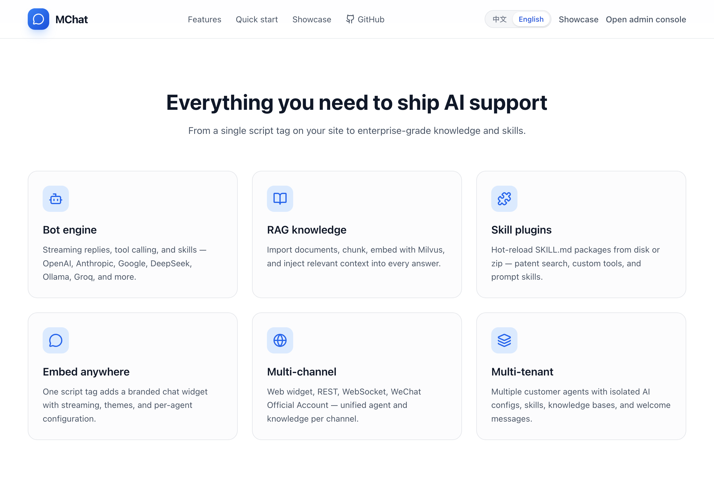
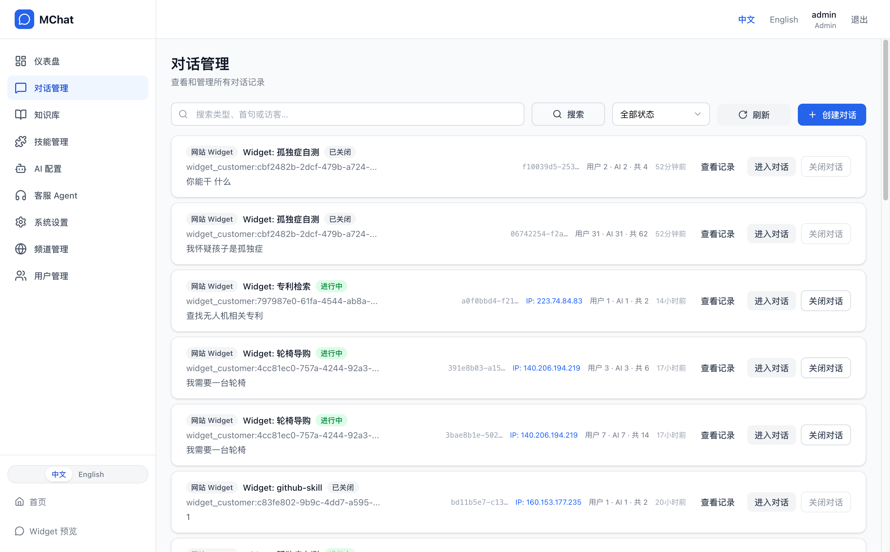
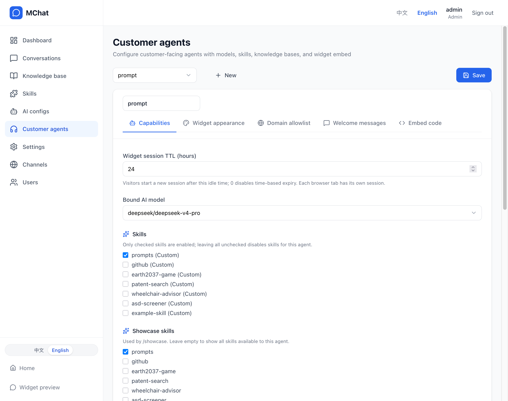
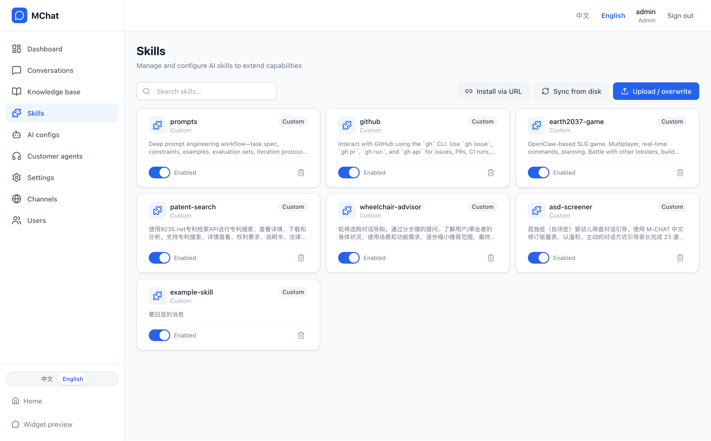
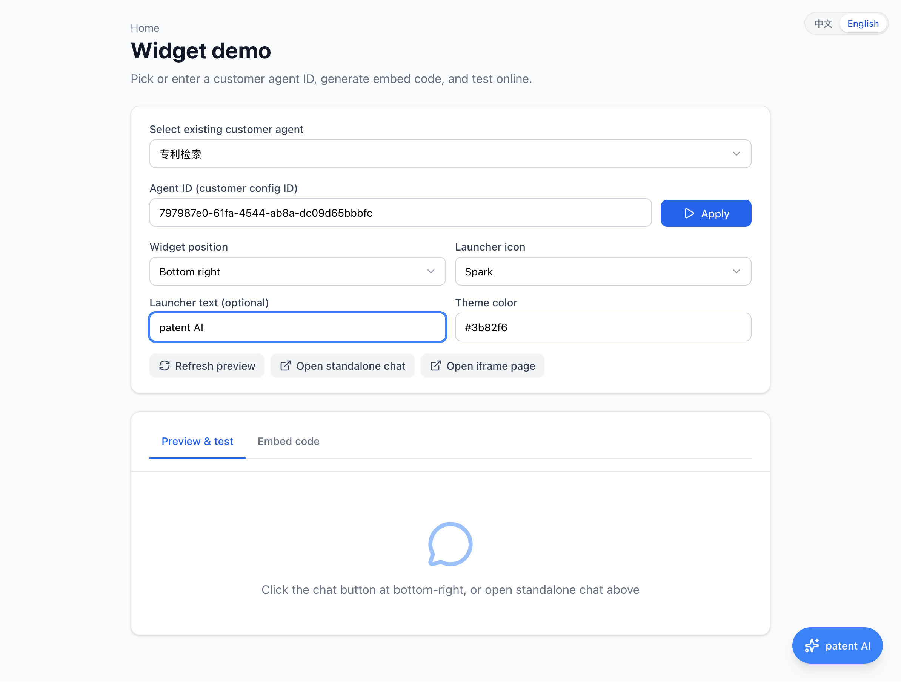
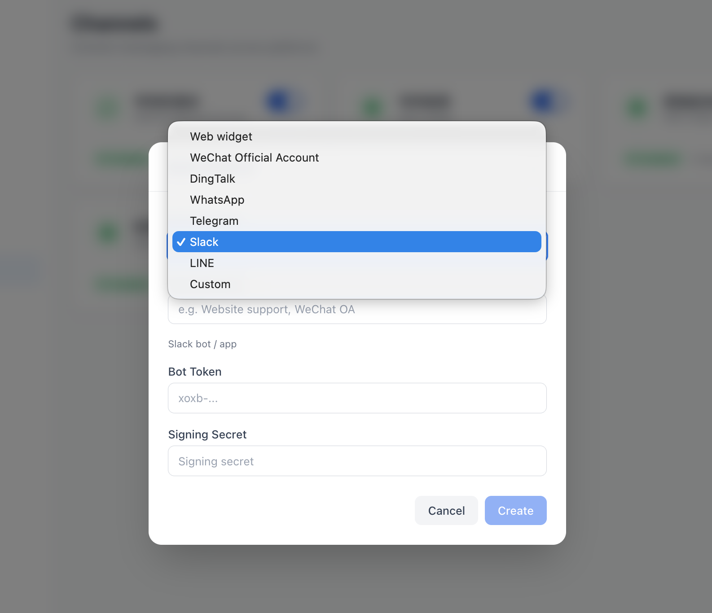
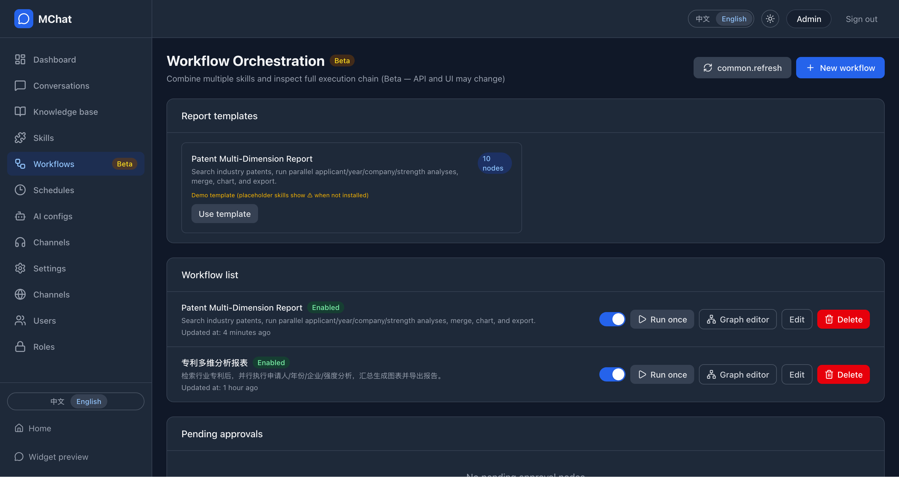
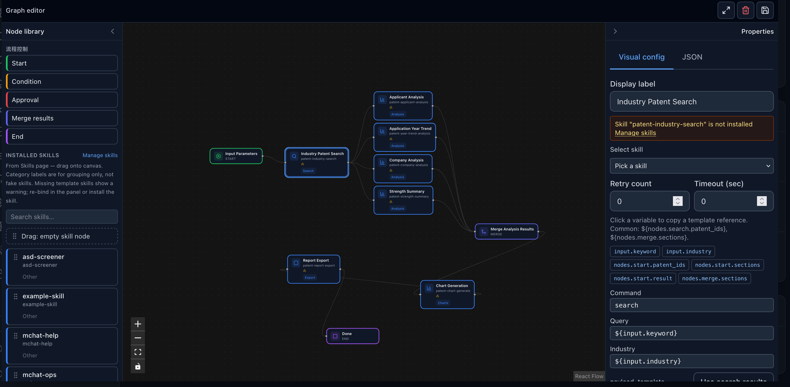

# MChat product tour (screenshots)

Live sites: [English](http://mchat.chat) · [Chinese](https://mchat.9235.net)

Click any screenshot to open the full image. Screens reflect the main branch; **Workflow orchestration is Beta**.

---

## Homepage & admin

---

## Conversations

---

## Vertical channel (Agent) config

---

## Knowledge base

---

## Skills

---

## Widget & chat

---

## Channels

---

## Workflow orchestration (Beta)

Chain multiple Skills into a DAG — manual runs, schedules, and channel trigger rules. Includes a patent multi-dimension report template.

### Workflow list & templates

### Visual graph editor

Details: [Workflow orchestrator (Beta)](workflow-orchestrator.en.md) · [Roadmap](roadmap.en.md)

---

## Related docs

- [Architecture](architecture.en.md)
- [API reference](api.en.md)
- [Deployment](deployment.en.md)
