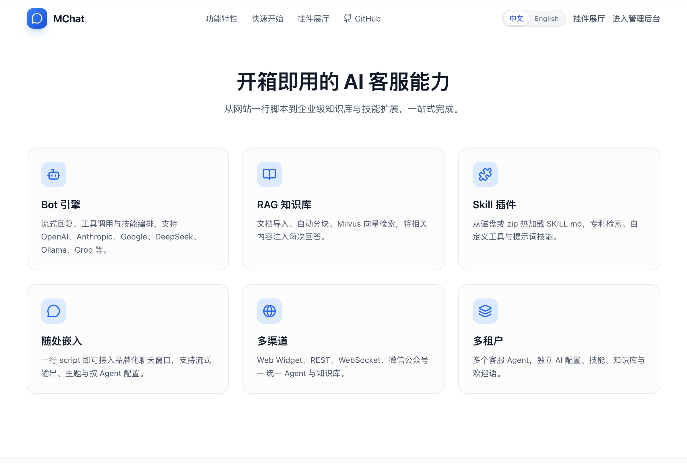
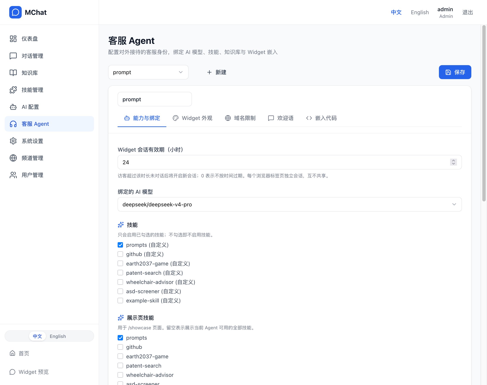
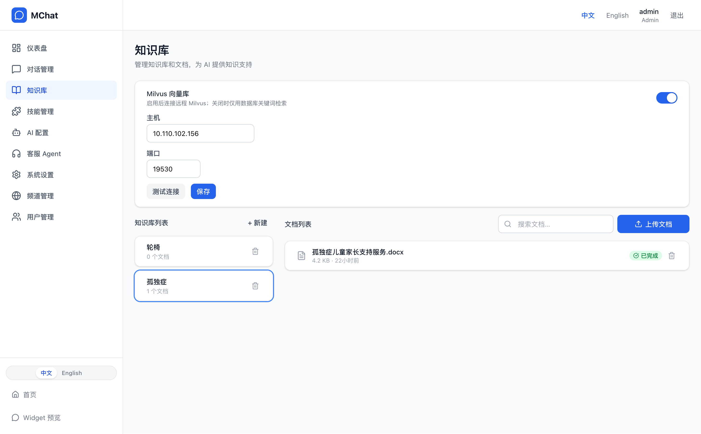
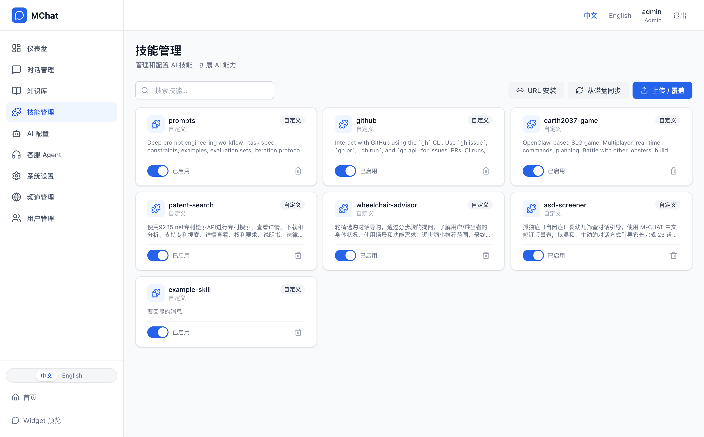
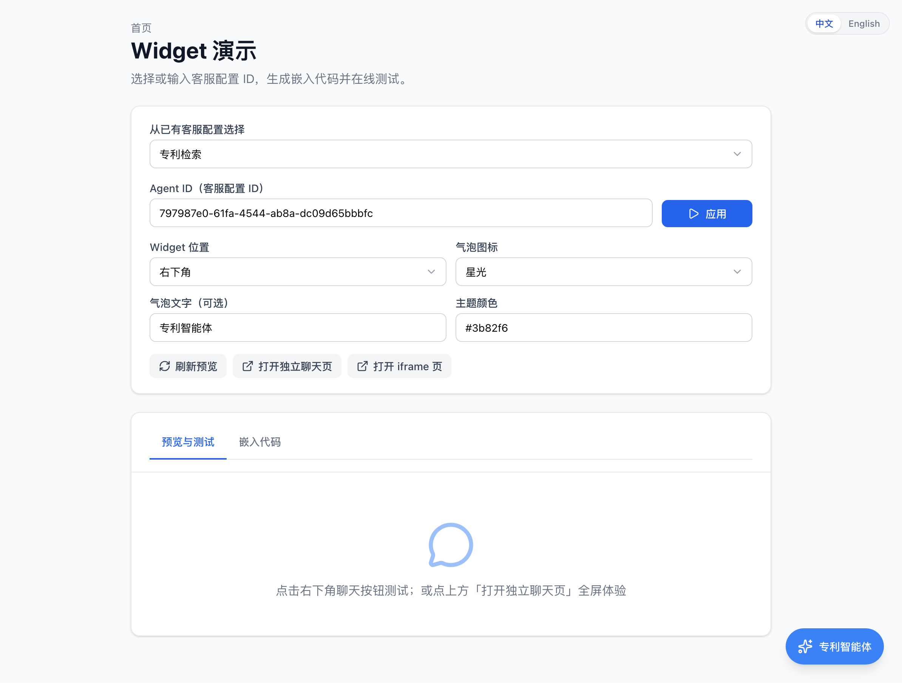
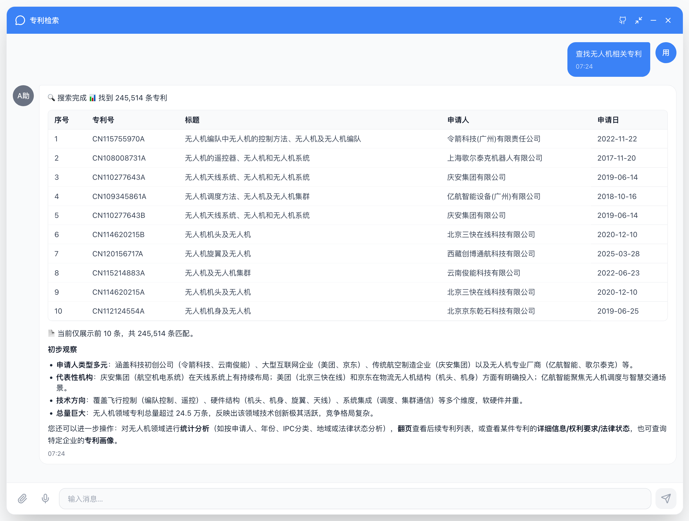
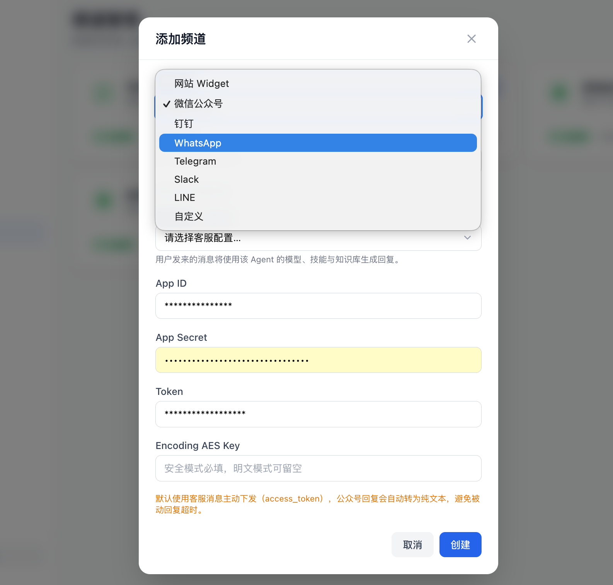
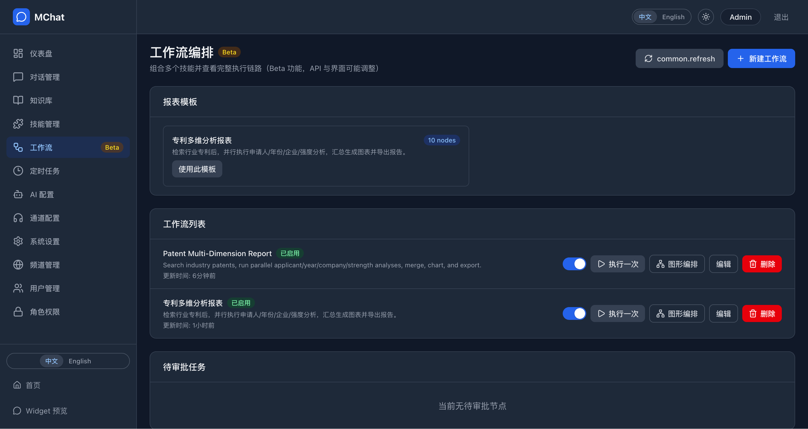
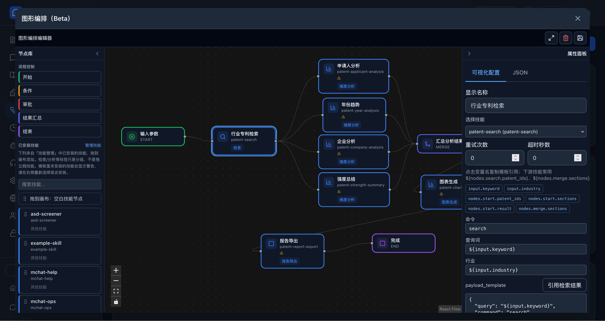

# MChat 产品导览（截图）

在线站点：[中文主站](https://mchat.9235.net) · [英文主站](http://mchat.chat)

点击任意截图可查看大图。图片与当前主分支功能对齐；Workflow 编排为 **Beta**。

---

## 首页与后台

---

## 对话管理

---

## 垂直通道（Agent）配置

---

## 知识库

---

## Skill 技能管理

---

## Widget 与聊天

---

## 渠道管理

---

## Workflow 编排（Beta）

将多个 Skill 编排为 DAG：手动运行、定时任务、频道规则触发；内置专利多维分析报表模板。

### 工作流列表与模板

### 可视化图编排

详细说明：[Workflow orchestrator（英文）](workflow-orchestrator.en.md) · [中文译本](workflow-orchestrator.zh.md) · [产品路线图](roadmap.zh.md)

---

## 相关文档

- [架构说明](architecture.zh.md)
- [API 参考](api.zh.md)
- [部署指南](deployment.zh.md)
